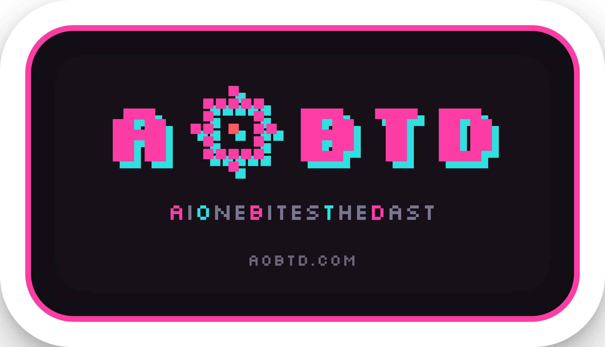
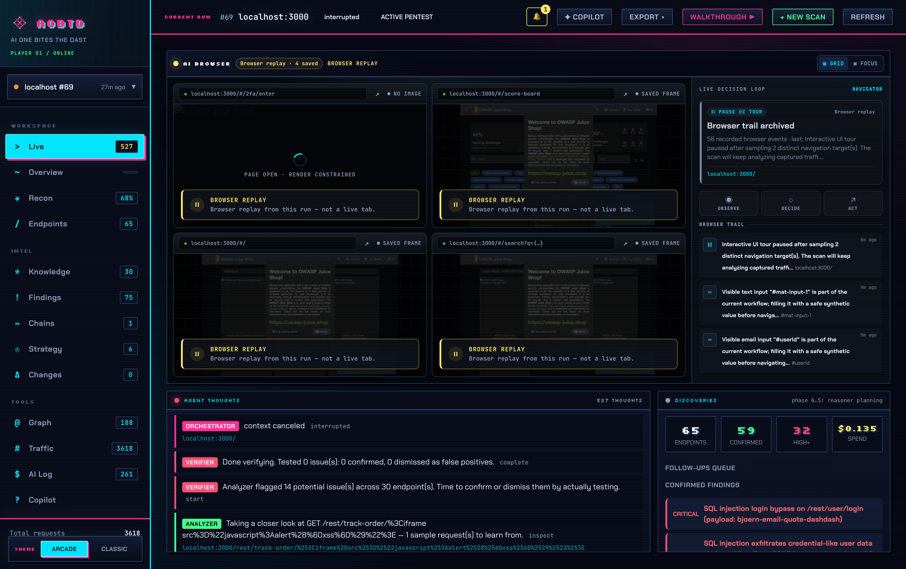
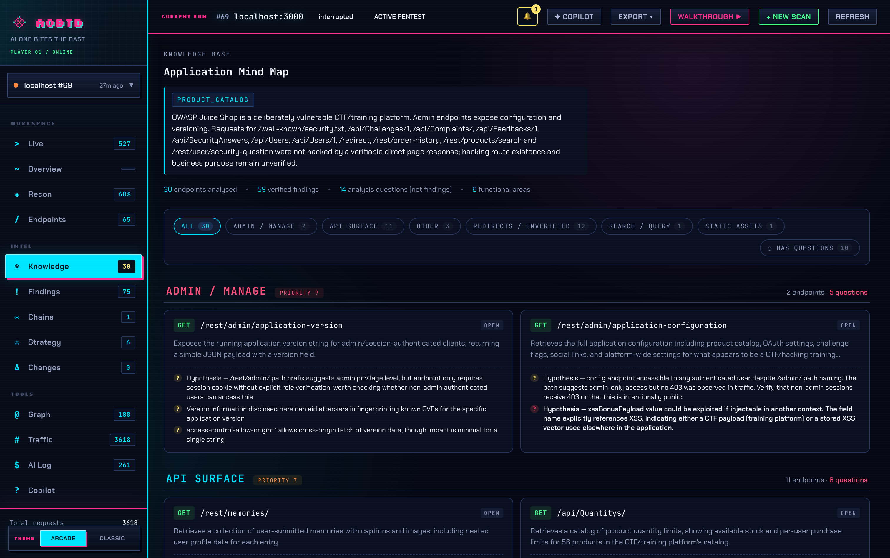
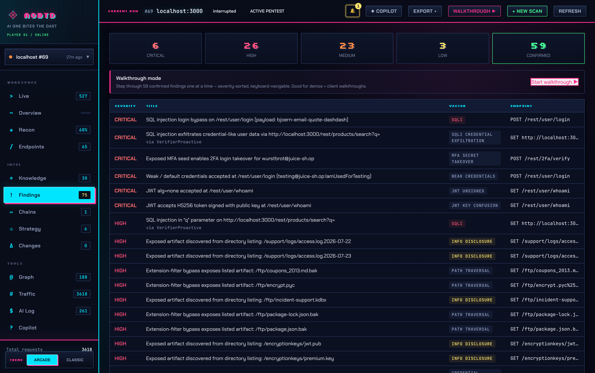

<p align="center">
  
</p>

<h3 align="center">AI One Bites The DAST</h3>

<p align="center">An LLM-driven web scanner that tries to understand a target before it attacks it.</p>

---

## What it is

Most DAST scanners fire thousands of payloads and hope something lands. They have no idea that a form is a login, or that they've already seen the same page template ten times over.

AOBTD goes at it differently. It drives the target through a MITM proxy, pulls every form, input and query param out with plain parsing (no LLM), groups them by endpoint, and hands the result to a few specialist LLM agents: auth, injection, access, and chain. Each one writes a small probe plan, an executor runs it, and anything it can actually prove comes back as a finding with a request/response PoC.

There's a zero-LLM path under all of it, so you still get input discovery and the verifier probes even with no key set.

<p align="center"></p>

## Running it

Build:

```bash
go build -o aobtd ./cmd/aobtd
```

The web UI is the easiest way in. Start it, click "Start New Scan", pick a target and a model:

```bash
./aobtd ui
# http://127.0.0.1:8090
```

Scans run in the background. The Live view streams what the agents are thinking, and finished scans stay in the same dashboard.

Or from the CLI:

```bash
# no LLM, still runs the extractor and the verifier probes
./aobtd scan --target http://localhost:3000/ --llm ""

# Anthropic
./aobtd scan --target http://localhost:3000/ \
  --llm anthropic --model claude-sonnet-4-6-20250514 --llm-key "$ANTHROPIC_API_KEY"

# OpenAI (auto-loads .env.local if present; keep that out of git)
./aobtd scan --target http://localhost:3000/ \
  --llm openai --model gpt-4.1-mini --reasoning-model gpt-5-mini

# any OpenAI-compatible endpoint: MiniMax, DeepSeek, GLM, local Ollama, ...
./aobtd scan --target http://localhost:3000/ \
  --llm openai-compatible --llm-url https://api.z.ai/api/paas/v4 --model glm-5.2
```

`--model` does the heavy lifting (profiling, navigation); `--reasoning-model` is an optional stronger model just for the domain reasoners.

If you need to widen scope:

```bash
# allow subdomains found while crawling (permits hosts, no DNS sweep)
./aobtd scan --target https://example.com --include-subdomains --testing-authority recon

# add explicit origins / wildcards
./aobtd scan --target https://app.example.com \
  --scope https://api.example.com --scope 'https://*.staging.example.com'
```

CLI and UI share one SQLite store, so a CLI scan opens in the UI, and a UI scan can be re-opened from disk with `./aobtd ui --input ./aobtd-output`.

## How it fits together

```
Browser (Rod / Chrome, headless)
      | HTTPS
MITM proxy (goproxy, :8089)
      |
SQLite scan.db    traffic, endpoints, profiles, findings, narrations
      |
      |- Extractor    HTML forms, JSON schemas, endpoint bundles (no LLM)
      |- Analyzer     endpoint by endpoint, template aware
      |- Reasoners    auth / injection / access / chain
      |     `- Executor with 8 technique primitives
      `- Verifier     black-box probes with real payloads
```

It all lands in SQLite, and the UI reads the same DB, so re-opening an old scan looks the same as watching a live one.

## What comes out

Every captured endpoint gets clustered into a knowledge base with a short note on what the model thinks it does, so you can see the shape of the app before you read a single finding.

<p align="center"></p>

Findings are sorted by severity, each with a PoC request/response, repro steps, impact and a fix. You can step through them one at a time in the UI, or export the lot to Markdown or HTML (Ctrl+P gives you a PDF).

<p align="center"></p>

Runs are cheap. A scan costs cents in LLM spend with a small model, and a budget guard makes the reasoners back off as you run low while the free extractor keeps going, so you don't come away empty-handed.

## Status

Pre-alpha, built for DEF CON 34 Demo Labs. Expect breakage and API churn.

## License

MIT
